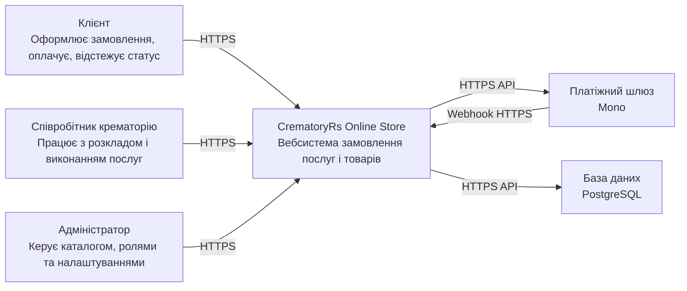
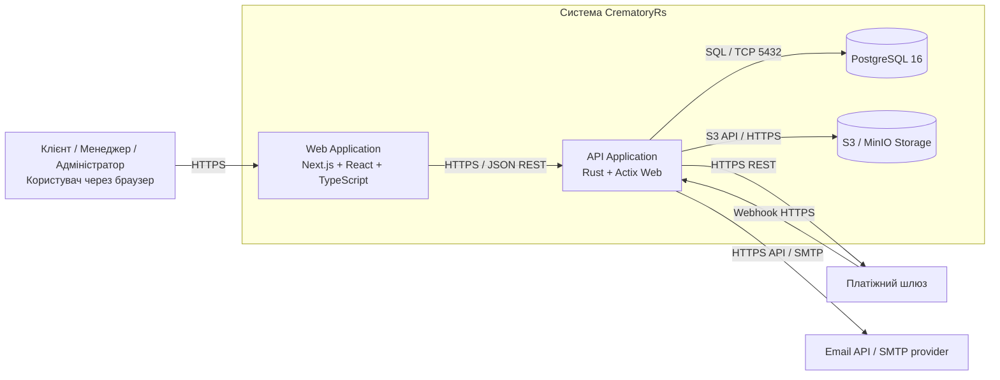
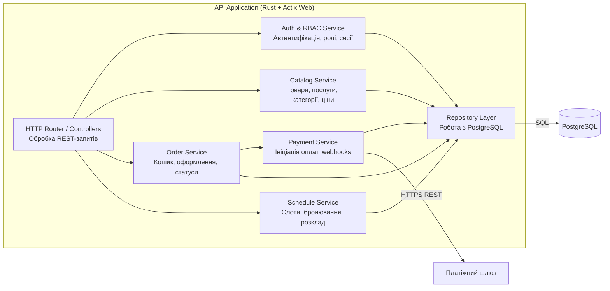
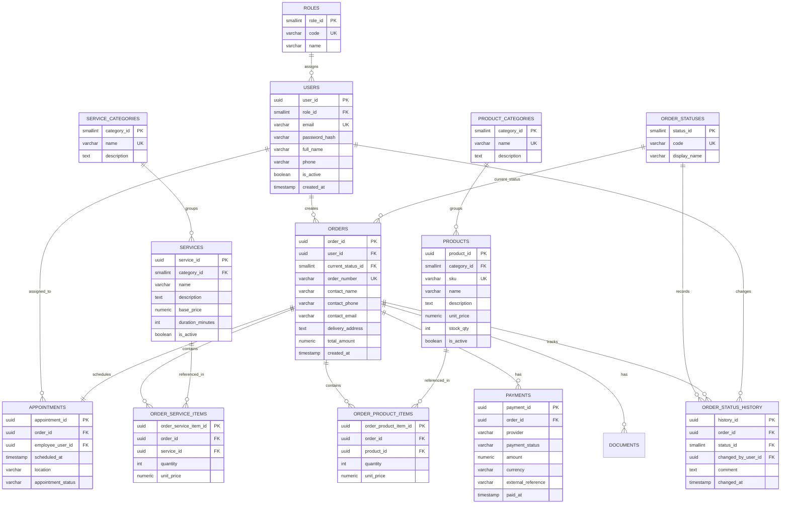

# Лабораторна робота №2

## Обґрунтування технологічного стеку, архітектурне моделювання C4 та проєктування бази даних

**Тема:** онлайн-магазин крематорію CrematoryRs для продажу послуг і супутніх товарів.

## 1. Вступ

На основі вимог, зібраних у лабораторній роботі №1, для системи CrematoryRs доцільно обрати архітектуру модульного моноліту з окремим фронтенд-контейнером і окремим API-контейнером. Такий підхід дає змогу швидко реалізувати навчальний проєкт, зберегти простоту розгортання та одночасно підтримати чітке розділення відповідальностей між інтерфейсом, бізнес-логікою, інтеграціями та збереженням даних.

Основний акцент системи зроблено на надійне оформлення замовлень, безпечну обробку персональних даних, онлайн-оплату, контроль статусів та керування каталогом послуг і товарів. Саме тому стек має забезпечувати сильну типізацію, передбачувану продуктивність, транзакційність і зручність супроводу.

## 2. Обґрунтування вибору технологічного стеку

### 2.1. Обрані технології

| Рівень | Технологія | Призначення | Обґрунтування |
| --- | --- | --- | --- |
| Back-end | **Rust + Tokio + Actix Web** | REST API, бізнес-логіка, інтеграції, авторизація | Rust забезпечує високу продуктивність, memory safety та сильну типізацію. Actix Web добре підходить для побудови швидких HTTP API, а Tokio ефективно обробляє велику кількість асинхронних запитів. |
| Front-end | **Next.js (React + TypeScript)** | Клієнтський вебінтерфейс, кабінет клієнта, адмін-панель, публічні сторінки | React спрощує побудову складних UI, а Next.js підтримує SSR/SSG, що корисно для швидкого завантаження публічних сторінок і SEO. TypeScript зменшує кількість помилок у фронтенді. |
| СКБД | **PostgreSQL 16** | Зберігання користувачів, замовлень, оплат, документів, каталогу | Для магазину послуг і товарів потрібні транзакції, зв'язки між сутностями та надійна цілісність даних. PostgreSQL добре підходить для ACID-сценаріїв і складних запитів. |
| DevOps / Hosting | **Docker, Docker Compose, GitHub Actions, Nginx** | Контейнеризація, CI/CD, деплой, reverse proxy | Docker спрощує локальний запуск і розгортання, GitHub Actions автоматизує збірку та перевірки, а Nginx зручно використовувати як зовнішній проксі для HTTPS і маршрутизації. |
| Оплати | **Monobank** | Онлайн-оплата замовлень | Платіжний провайдер забезпечує безпечну обробку транзакцій, webhooks і підтвердження статусів оплат. |

### 2.2. Пояснення вибору стеку

Для бекенду доцільно обрати саме `Rust + Actix Web`, оскільки проєкт уже має серверну основу на Rust, а сама предметна область вимагає надійної обробки чутливих даних, замовлень і платежів. Rust дає сильний контроль над помилками та конкурентним виконанням, що особливо цінно для API з інтеграціями, журналюванням та майбутнім масштабуванням.

Для фронтенду найбільш практичним вибором є `Next.js (React + TypeScript)`. Це дозволяє поєднати SEO-дружні публічні сторінки каталогу та FAQ з інтерактивними формами оформлення замовлення, кабінетом клієнта й адмін-панеллю. `PostgreSQL` обрано через чітко структуровані сутності: користувачі, ролі, товари, послуги, замовлення, платежі, документи та історія статусів. Для навчального корпоративного вебдодатку такий стек є збалансованим за швидкістю розробки, надійністю й зрозумілістю.

## 3. Архітектурне моделювання за методологією C4

### 3.1. Рівень 1. System Context Diagram

**Опис:** на контекстному рівні система CrematoryRs розглядається як єдина "чорна скринька". Навколо неї показано основних користувачів та зовнішні сервіси: платіжний шлюз, поштовий сервіс і файлове сховище.

### 3.2. Рівень 2. Container Diagram

**Опис:** система складається з чотирьох основних контейнерів: вебклієнта, API, бази даних і файлового сховища. Усі бізнес-операції виконуються через Rust API, а фронтенд відповідає за інтерфейс користувача та взаємодію з бекендом через HTTPS.

### 3.3. Рівень 3. Component Diagram для контейнера API Application

**Опис:** компонентна діаграма деталізує API-контейнер. Усі HTTP-запити надходять у роутери/контролери, після чого передаються до відповідних сервісів. Бізнес-сервіси працюють через репозиторії з PostgreSQL і, за потреби, інтегруються із зовнішніми провайдерами оплат, email та файлового зберігання.

## 4. Проєктування бази даних

### 4.1. Обраний підхід

Для CrematoryRs доцільно використати **реляційну базу даних PostgreSQL** і побудувати **ER-модель**, оскільки система працює з транзакційними та сильно пов'язаними даними: користувачі, ролі, каталог, замовлення, позиції замовлення, платежі, документи та історія статусів. У такому сценарії важливі цілісність даних, підтримка зовнішніх ключів і можливість виконувати складні аналітичні запити.

### 4.2. ER-діаграма

### 4.3. Пояснення моделі та нормалізації

- Довідники ролей, категорій і статусів винесено в окремі таблиці, щоб уникнути дублювання текстових значень.
- Зв'язок між замовленням і товарами/послугами реалізовано через окремі таблиці `ORDER_PRODUCT_ITEMS` та `ORDER_SERVICE_ITEMS`, що усуває проблему M:N.
- Історію змін статусів винесено в окрему таблицю `ORDER_STATUS_HISTORY`, тому поточний статус і журнал змін не змішуються.
- Таблиця `PAYMENTS` відокремлена від `ORDERS`, оскільки одне замовлення може мати кілька спроб оплати.
- Модель відповідає 3НФ: неключові атрибути залежать від ключа своєї сутності, а транзитивні залежності винесені в довідники.

## 5. Короткий висновок

Для CrematoryRs рекомендовано стек `Rust + Actix Web` на бекенді, `Next.js + React + TypeScript` на фронтенді, `PostgreSQL` як основну СКБД та `Docker + GitHub Actions` для DevOps-процесу. Архітектурно система проєктується як модульний моноліт із чітким розділенням на вебклієнт, API, базу даних і файлове сховище. Такий підхід покриває вимоги до безпеки, продуктивності, надійності та зручності супроводу.

## 6. Відповіді на контрольні запитання

### 6.1. Що таке модель C4 і для чого потрібен кожен з її рівнів?

Модель C4 це підхід до архітектурної документації, який описує систему на кількох рівнях деталізації:

- **Context:** показує систему як єдине ціле, її користувачів та зовнішні системи.
- **Container:** показує основні технічні частини системи: вебклієнт, API, базу даних, сховища, інтеграції.
- **Component:** деталізує один контейнер і пояснює, з яких логічних компонентів він складається.

Таким чином C4 допомагає поступово перейти від загального уявлення про систему до її внутрішньої структури.

### 6.2. У чому різниця між SQL та NoSQL базами даних? Коли варто обирати кожну?

Реляційні СКБД (SQL) працюють зі строгою схемою, підтримують транзакції, зовнішні ключі та складні JOIN-запити. Вони найкраще підходять для систем, де важлива узгодженість даних: замовлення, платежі, облік, документообіг.

Нереляційні СКБД (NoSQL) зазвичай мають гнучкішу схему, краще масштабуються горизонтально та зручні для документних, подієвих або кешувальних сценаріїв. Їх варто обирати, коли структура даних часто змінюється, потрібна висока швидкість запису або дуже великі обсяги напівструктурованих даних.

### 6.3. Що таке теорема CAP і як вона впливає на вибір бази даних?

Теорема CAP стверджує, що в розподіленій системі під час мережевого розділення неможливо одночасно гарантувати повну **Consistency**, повну **Availability** і **Partition tolerance**. На практиці це означає, що архітектор обирає компроміс.

Для системи на кшталт CrematoryRs критичними є правильність статусів замовлень і платежів, тому перевага надається більш консистентній моделі зберігання. Саме тому PostgreSQL є кращим вибором для основної БД, а менш критичні задачі, наприклад кешування, за потреби можна винести в окремі AP-орієнтовані інструменти.

### 6.4. Які переваги та недоліки мікросервісної архітектури порівняно з монолітною?

**Переваги мікросервісів:**
- незалежне масштабування окремих сервісів;
- незалежні релізи для різних підсистем;
- краща ізоляція великих доменів у великих командах.

**Недоліки мікросервісів:**
- вища складність розгортання, спостережуваності й тестування;
- складніша міжсервісна взаємодія;
- важчий контроль транзакцій та узгодженості даних.

**Переваги модульного моноліту:**
- простіший старт проєкту;
- легший деплой і налагодження;
- простіше забезпечити транзакційність і цілісність даних.

Для навчального інтернет-магазину CrematoryRs більш виправданим є саме модульний моноліт, а не повноцінна мікросервісна архітектура.
