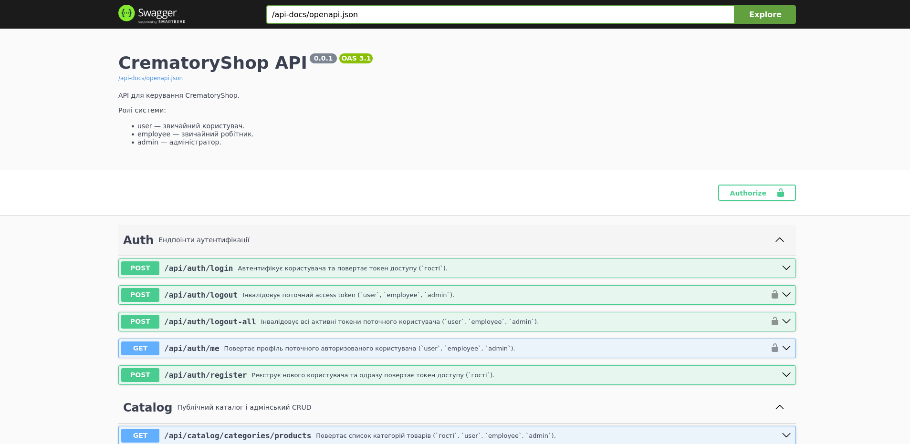
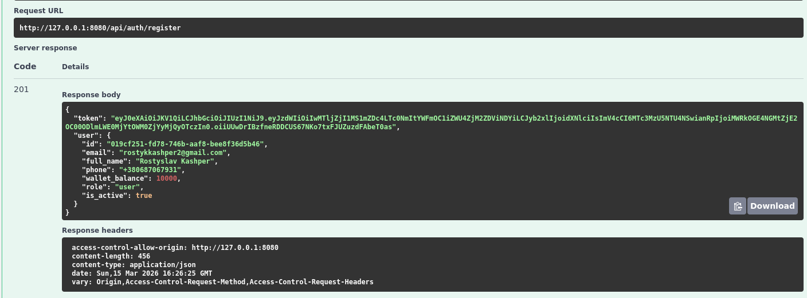
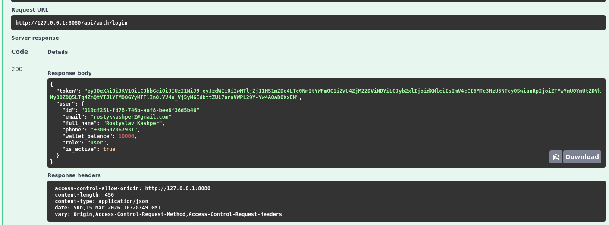
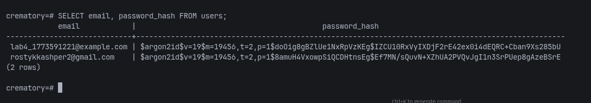
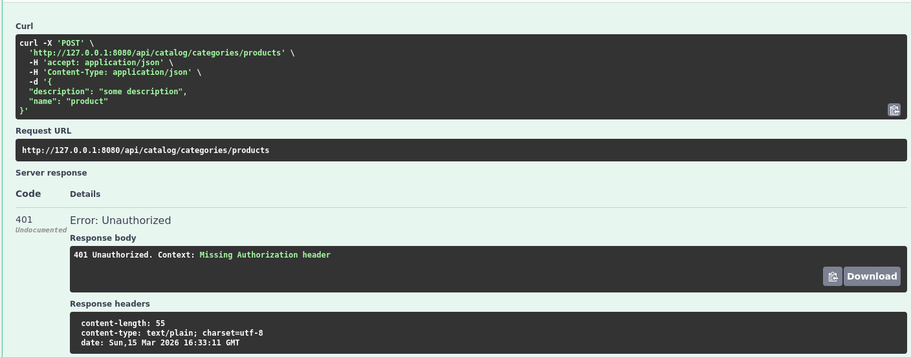
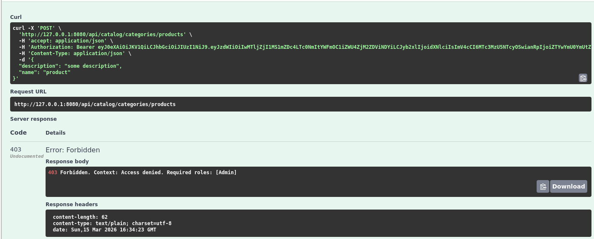

# Lab 4. Автентифікація, авторизація та захист API

## 1. Посилання на Git-репозиторій

- Репозиторій: `https://github.com/FantRS/TRVD_2026_404-TN_Kashper_Labs.git`

## 2. Мета роботи

Мета роботи полягала в захисті API від несанкціонованого доступу, реалізації реєстрації та входу користувачів, а також у розмежуванні доступу до ресурсів на основі ролей.

## 3. Що було реалізовано на бекенді

У поточному REST API було реалізовано повний базовий цикл безпеки:

- модель `Role` та `User` у PostgreSQL;
- безпечне зберігання паролів через `Argon2id`;
- ендпоінт реєстрації `POST /api/auth/register`;
- ендпоінт входу `POST /api/auth/login`;
- генерація `JWT access token`;
- збереження в токені `user id` та `role`;
- перевірка токена через `AuthMiddleware`;
- розмежування доступу за ролями через `RoleGuardFactory`;
- розподіл маршрутів на:
  - `public`;
  - `authenticated`;
  - `admin`.

Додатково в межах проєкту вже працюють:

- `logout` і `logout-all`;
- endpoint `GET /api/auth/me`;
- Redis whitelist для JWT;
- захищені користувацькі маршрути (`orders`, `payments`, `profile-like endpoints`);
- адмінські маршрути (`/api/users`, admin CRUD каталогу, reports).

## 4. Як це реалізовано

### 4.1. Модель користувача та ролей

У базі даних використовується таблиця `roles` і таблиця `users`.

У `users` зберігаються:

- `id`;
- `role_id`;
- `email`;
- `password_hash`;
- `full_name`;
- `phone`;
- `wallet_balance`;
- `is_active`;
- `created_at`, `updated_at`.

Пароль у відкритому вигляді не зберігається. Перед записом у БД він хешується через `Argon2`.

### 4.2. Реєстрація

Під час реєстрації:

1. сервер валідовує email, пароль, ім’я та телефон;
2. перевіряє, чи не існує користувач із таким email;
3. хешує пароль;
4. створює нового користувача;
5. автоматично нараховує стартовий бонус внутрішньої валюти;
6. генерує JWT токен;
7. додає токен у Redis whitelist.

### 4.3. Вхід у систему

Під час логіну:

1. сервер знаходить користувача за email;
2. перевіряє, що акаунт активний;
3. порівнює пароль із хешем через `verify_password`;
4. генерує підписаний JWT;
5. повертає токен клієнту.

### 4.4. Автентифікація через middleware

`AuthMiddleware`:

- читає заголовок `Authorization`;
- перевіряє схему `Bearer`;
- декодує та валідує JWT;
- перевіряє наявність токена в Redis whitelist;
- додає `Claims` у request extensions.

Якщо токен відсутній або невалідний, сервер повертає `401 Unauthorized`.

### 4.5. Авторизація через RBAC

`RoleGuardFactory` реалізує `Role-Based Access Control`.

У проєкті використовуються ролі:

- `user`
- `employee`
- `admin`

Фабрики guard-ів:

- `admin_only()`
- `all_employees()`
- `user_only()`

Якщо користувач автентифікований, але не має потрібної ролі, сервер повертає `403 Forbidden`.

## 5. Перевірені сценарії

Для звіту локально були виконані реальні HTTP-запити до піднятого API. Для тесту використовувався користувач:

- `lab4_1773591221@example.com`

Підсумкові результати:

- реєстрація: `201 Created`
- логін: `200 OK`
- захищений запит без токена: `401 Unauthorized`
- запит звичайного користувача до адмін-ресурсу: `403 Forbidden`
- запит до захищеного ресурсу з валідним токеном: `200 OK`

## 6. Скріншоти

### 6.1. Swagger UI

Огляд Swagger UI для поточного REST API:



### 6.2. Успішна реєстрація

`POST /api/auth/register`



### 6.3. Успішний логін та отримання JWT

`POST /api/auth/login`



### 6.4. Знімок БД, де пароль збережено як хеш

У полі `password_hash` видно `Argon2`-хеш, а не відкритий пароль.



### 6.5. Запит без токена -> `401 Unauthorized`

Сценарій: доступ до захищеного маршруту без `Authorization: Bearer ...`



### 6.6. Запит звичайного користувача до адмін-панелі -> `403 Forbidden`

Сценарій: `GET /api/users` з токеном користувача ролі `user`



## 7. Приклади коду

### 7.1. Визначення моделі API

Приклад DTO для реєстрації користувача:

```rust
#[derive(Debug, Deserialize, ToSchema)]
pub struct RegisterRequest {
    pub email: String,
    pub password: String,
    pub full_name: String,
    pub phone: Option<String>,
}

#[derive(Debug)]
pub struct RegisterRequestValid {
    pub email: String,
    pub password: String,
    pub full_name: String,
    pub phone: Option<String>,
}

impl TryFrom<RegisterRequest> for RegisterRequestValid {
    type Error = RequestError;

    fn try_from(value: RegisterRequest) -> Result<Self, Self::Error> {
        let password = value.password.trim().to_owned();
        if password.len() < 8 || password.len() > 128 {
            return Err(RequestError::unprocessable_entity(
                "password must contain from 8 to 128 characters",
            ));
        }

        Ok(Self {
            email: normalized_email(&value.email, "email")?,
            password,
            full_name: trimmed_required(&value.full_name, "full_name", 3, 255)?,
            phone: match value.phone {
                Some(phone) => Some(phone_number(&phone, "phone")?),
                None => None,
            },
        })
    }
}
```

Приклад JWT claims:

```rust
#[derive(Debug, Serialize, Deserialize, Clone)]
pub struct Claims {
    pub sub: Uuid,
    pub role: UserRole,
    pub exp: usize,
    pub jti: String,
}
```

### 7.2. Реалізація методу входу

Нижче наведено фрагмент сервісу логіну, який перевіряє пароль і видає JWT:

```rust
pub async fn login(
    request: LoginRequestValid,
    ctx: &ServiceContext<'_>,
) -> RequestResult<LoginResponse> {
    let user_row = repository::find_user_by_email(&request.email, ctx.db_pool).await?;

    if !user_row.is_active {
        return Err(RequestError::forbidden("user account is inactive"));
    }

    verify_password(&request.password, &user_row.password_hash)?;
    let user = AuthUserResponse::try_from(user_row)?;
    let (token, claims) = create_jwt(user.id, user.role, ctx.jwt_secret)?;
    token_wl_service::add_to_whitelist(&claims, ctx).await?;

    Ok(LoginResponse { token, user })
}
```

### 7.3. Реалізація middleware авторизації

Фрагмент `RoleGuard`, який обмежує доступ за роллю:

```rust
impl RoleGuardFactory {
    pub fn admin_only() -> Self {
        Self::new(vec![UserRole::Admin])
    }

    pub fn all_employees() -> Self {
        Self::new(vec![UserRole::Employee, UserRole::Admin])
    }

    pub fn user_only() -> Self {
        Self::new(vec![UserRole::User])
    }
}

fn call(&self, req: ServiceRequest) -> Self::Future {
    let claims = req.extensions().get::<Claims>().cloned();

    match claims {
        Some(claims) => {
            if claims.has_any_role(self.allowed_roles.as_ref()) {
                let fut = self.service.call(req);
                Box::pin(async move {
                    let res = fut.await?;
                    Ok(res)
                })
            } else {
                let err = RequestError::Forbidden(format!(
                    "Access denied. Required roles: {:?}",
                    self.allowed_roles.as_ref()
                ));
                Box::pin(async move { Err(Error::from(err)) })
            }
        }
        None => {
            let err = RequestError::Unauthorized("Authentication required".to_string());
            Box::pin(async move { Err(Error::from(err)) })
        }
    }
}
```

## 8. Висновок

У цій лабораторній роботі REST API було успішно захищено від несанкціонованого доступу. Реалізовано безпечну роботу з паролями, вхід через JWT, middleware перевірки токенів і role-based authorization. Усі ключові сценарії перевірені практично: успішна реєстрація, логін, помилка `401` без токена, помилка `403` при нестачі прав і успішний доступ до захищеного ресурсу з валідним токеном.

## 9. Контрольні запитання

### 9.1. У чому різниця між автентифікацією (Authentication) та авторизацією (Authorization)?

Автентифікація відповідає на питання: "Хто ти?". Вона перевіряє особу користувача, наприклад через логін і пароль.

Авторизація відповідає на питання: "Що тобі дозволено?". Вона перевіряє, чи має вже автентифікований користувач право доступу до конкретного ресурсу або дії.

### 9.2. Чому не можна зберігати паролі у відкритому вигляді? Що таке "Сіль" (Salt) і навіщо вона потрібна при хешуванні?

Паролі не можна зберігати у відкритому вигляді, тому що в разі витоку БД зловмисник одразу отримає реальні облікові дані користувачів.

`Salt` — це випадкове значення, яке додається до пароля перед хешуванням. Воно потрібне для того, щоб:

- однакові паролі мали різні хеші;
- ускладнити використання готових таблиць хешів;
- зробити масові атаки на паролі значно дорожчими.

### 9.3. Опишіть структуру JWT токена (Header, Payload, Signature). Де зберігається інформація про роль користувача?

JWT складається з трьох частин:

- `Header` — тип токена та алгоритм підпису;
- `Payload` — корисні дані, наприклад `sub`, `role`, `exp`, `jti`;
- `Signature` — криптографічний підпис, який захищає токен від підробки.

Інформація про роль користувача зберігається в `Payload`, у claim `role`.

### 9.4. Яка різниця між симетричним та асиметричним шифруванням при підписі токенів?

При симетричному підписі той самий секретний ключ використовується і для створення підпису, і для перевірки. Це простіше в налаштуванні, але вимагає безпечного спільного зберігання секрету.

При асиметричному підписі використовується пара ключів:

- приватний ключ підписує;
- публічний ключ перевіряє.

Такий підхід зручний, якщо токен має перевіряти багато окремих сервісів без роздачі приватного ключа.

### 9.5. Що таке атаки Brute Force та Rainbow Table? Як захиститися від них?

`Brute Force` — це спроба перебору великої кількості паролів або комбінацій до моменту вгадування правильного значення.

`Rainbow Table` — це готові таблиці відповідностей між паролями та їх хешами, які використовують для швидкого пошуку слабких або часто вживаних паролів.

Захист:

- використовувати повільні password hashing алгоритми (`Argon2`, `bcrypt`, `PBKDF2`);
- застосовувати `salt`;
- обмежувати кількість спроб входу;
- додавати rate limiting;
- використовувати складні паролі;
- блокувати або тимчасово обмежувати підозрілі акаунти.

### 9.6. Поясніть принцип роботи Role-Based Access Control (RBAC).

`RBAC` — це модель контролю доступу, у якій права призначаються не напряму кожному користувачу, а ролям.

Схема роботи така:

1. у системі визначаються ролі;
2. ролям задаються дозволені дії;
3. користувачеві призначається роль;
4. при запиті система перевіряє роль користувача і вирішує, чи можна виконати дію.

У поточному проєкті:

- `user` має доступ до користувацьких сценаріїв;
- `employee` має доступ до працівницьких сценаріїв;
- `admin` має доступ до адміністративних ресурсів.
