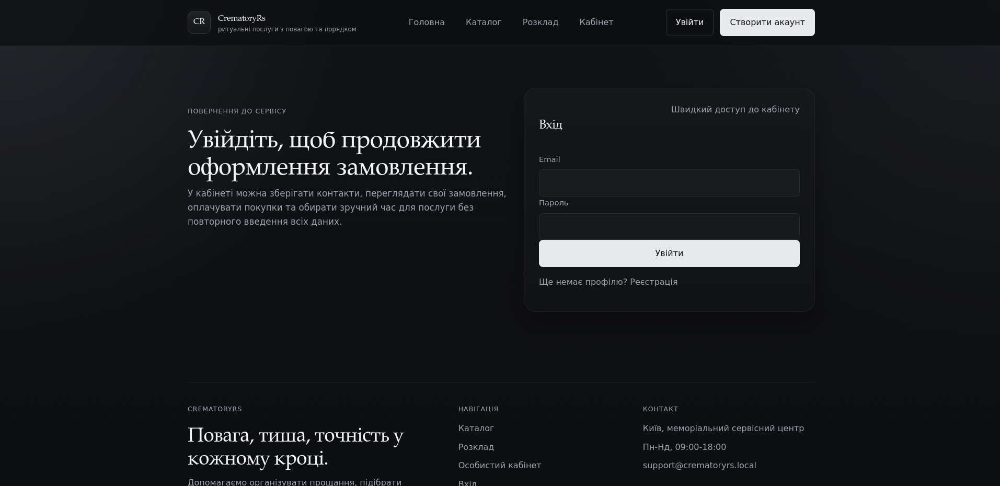
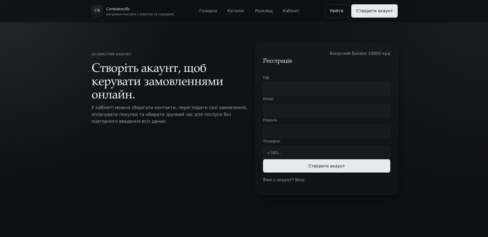
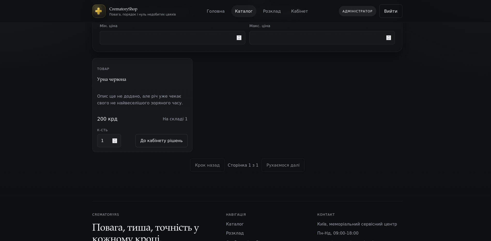
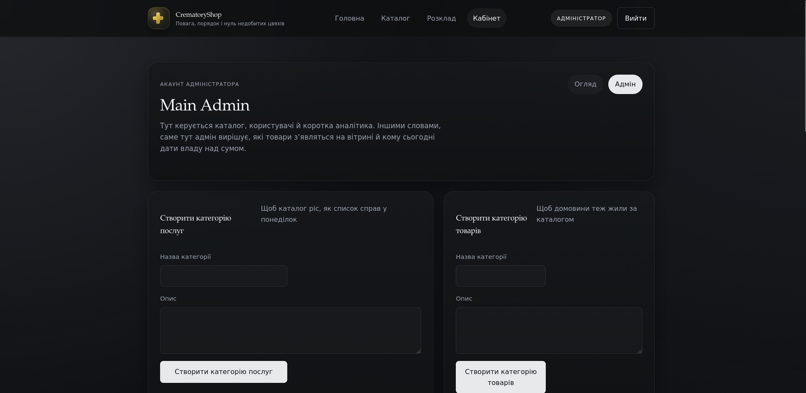
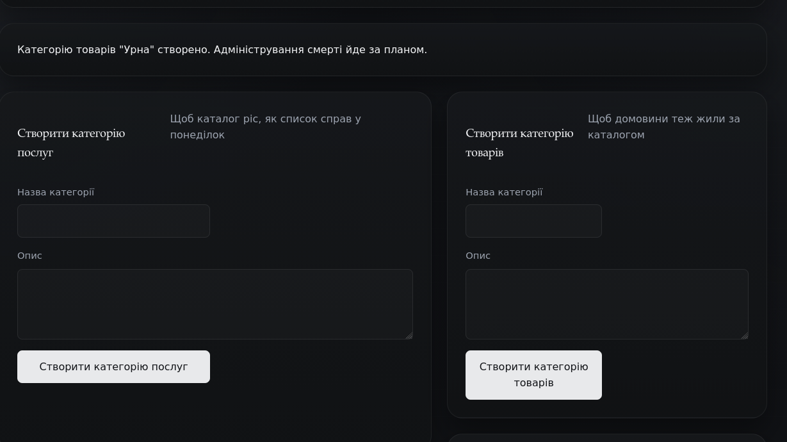
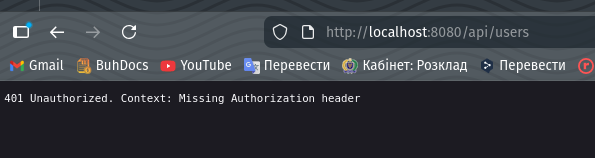
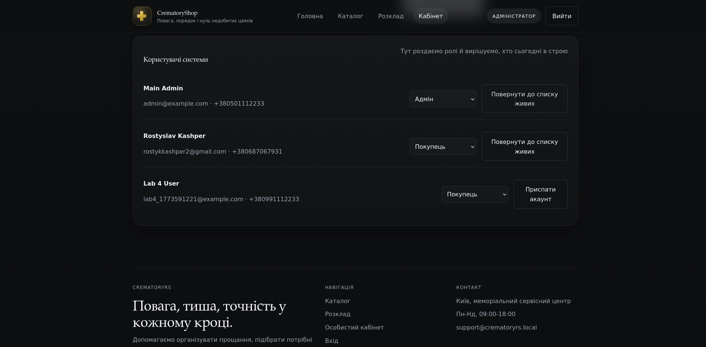

# Lab 5. Звіт по реалізованому фронтенду

## 1. Посилання на Git-репозиторій

- Репозиторій: `https://github.com/FantRS/TRVD_2026_404-TN_Kashper_Labs.git`
- Frontend-проєкт: `front/`

## 2. Мета роботи

У межах лабораторної було реалізовано повнофункціональний frontend для сервісу крематорію на `Next.js`.
Інтерфейс інтегрований з наявним REST API, підтримує публічний перегляд каталогу для гостей, а також
авторизовані сценарії для покупця та адміністратора.

## 3. Технологічний стек фронтенду

- `Next.js 15`
- `React 19`
- `TypeScript`
- `CSS` через глобальні стилі в `globals.css`
- клієнтська авторизація через `AuthProvider`
- інтеграція з REST API через `fetch`
- запуск у Docker через окремий сервіс `frontend`

## 4. Що було реалізовано

### 4.1. Основні сторінки

Було реалізовано такі сторінки:

- `/`:
  головна сторінка з описом сервісу, аргументами "чому обирають нас" та preview каталогу;
- `/catalog`:
  публічний каталог послуг і товарів з пошуком, фільтрами та пагінацією;
- `/schedule`:
  перегляд доступних слотів;
- `/login`:
  форма входу;
- `/register`:
  форма реєстрації;
- `/account`:
  особистий кабінет, зміст якого залежить від ролі користувача.

### 4.2. Робота з ролями та доступом

На фронтенді реалізовано умовний захист інтерфейсу на основі ролі користувача:

- `guest`:
  бачить головну сторінку, каталог, розклад, логін і реєстрацію;
- `user`:
  бачить баланс внутрішньої валюти, кошик, замовлення, оплату та бронювання часу;
- `admin`:
  у кабінеті отримує окрему вкладку `Адмін`, де доступне створення записів і керування користувачами.

Важливий нюанс: у поточній версії захист реалізований не через `Next.js middleware`, а через
умовний рендер сторінки `/account` та перевірку токена під час звернення до захищених API-ендпоінтів.

### 4.3. Реалізовані користувацькі сценарії

Для звичайного покупця:

- реєстрація та логін;
- збереження токена та снапшоту користувача в `localStorage`;
- перегляд каталогу;
- додавання товарів і послуг у кошик;
- редагування кількості та видалення позицій з кошика;
- оформлення замовлення;
- оплата з внутрішнього гаманця;
- перегляд історії замовлень;
- створення запису на слот.

Для адміністратора:

- окрема вкладка `Адмін` в кабінеті;
- створення категорій послуг;
- створення категорій товарів;
- створення послуг;
- створення товарів;
- перегляд користувачів;
- зміна ролі користувача;
- активація / деактивація акаунтів;
- перегляд короткої аналітики по замовленнях і оплатах.

## 5. Структура реалізації

Ключові частини фронтенду:

- `front/src/app/`:
  route-level сторінки;
- `front/src/components/`:
  UI-компоненти та доменні екрани;
- `front/src/lib/api.ts`:
  клієнт для REST API;
- `front/src/lib/auth.tsx`:
  контекст авторизації;
- `front/src/lib/storage.ts`:
  робота з `localStorage`;
- `front/src/app/globals.css`:
  стилізація всього сайту.

## 6. Приклади коду

### 6.1. Форма логіну / реєстрації

Нижче наведено фрагмент компонента форми авторизації. Він підтримує два режими:
`login` і `register`, викликає відповідний API-метод і після успіху переводить користувача до `/account`.

```tsx
export function AuthForm({ mode }: { mode: "login" | "register" }) {
  const router = useRouter();
  const { signIn, signUp } = useAuth();
  const [error, setError] = useState<string | null>(null);
  const [submitting, setSubmitting] = useState(false);
  const [form, setForm] = useState({
    email: "",
    password: "",
    full_name: "",
    phone: "",
  });

  const isLogin = mode === "login";

  async function handleSubmit(event: React.FormEvent<HTMLFormElement>) {
    event.preventDefault();
    setSubmitting(true);
    setError(null);

    try {
      if (isLogin) {
        await signIn({
          email: form.email,
          password: form.password,
        });
      } else {
        await signUp({
          email: form.email,
          password: form.password,
          full_name: form.full_name,
          phone: form.phone || undefined,
        });
      }

      router.push("/account");
    } catch (submitError) {
      setError(submitError instanceof Error ? submitError.message : "Не вдалося виконати запит.");
    } finally {
      setSubmitting(false);
    }
  }
}
```

У формах використано вбудовану браузерну валідацію (`required`, `type="email"`, `minLength`) та
обробку помилок API через локальний стан `error`.

### 6.2. Реалізація авторизаційного контексту

Контекст авторизації відповідає за збереження сесії, відновлення токена після перезавантаження сторінки
та отримання поточного профілю користувача.

```tsx
export function AuthProvider({ children }: { children: ReactNode }) {
  const [token, setToken] = useState<string | null>(null);
  const [user, setUser] = useState<AuthUser | null>(null);
  const [isHydrated, setIsHydrated] = useState(false);

  useEffect(() => {
    const storedToken = getStoredToken();
    const storedUser = getStoredUserSnapshot<AuthUser>();

    if (!storedToken) {
      setIsHydrated(true);
      return;
    }

    setToken(storedToken);
    if (storedUser) {
      setUser(storedUser);
    }

    void getCurrentUser(storedToken)
      .then((response) => {
        setUser(response.user);
        setStoredUserSnapshot(response.user);
      })
      .catch(() => {
        clearSession();
        setToken(null);
        setUser(null);
      })
      .finally(() => {
        setIsHydrated(true);
      });
  }, []);
```

### 6.3. Інтерфейс створення записів в адмінці

Адміністратор може створювати нові товари та категорії безпосередньо з вкладки `Адмін`.

```tsx
async function handleCreateProduct(event: React.FormEvent<HTMLFormElement>) {
  event.preventDefault();
  setSubmitting(true);
  setNotice(null);
  setError(null);

  try {
    const product = await createProduct(
      {
        category_id: productForm.category_id,
        sku: productForm.sku,
        name: productForm.name,
        description: productForm.description || undefined,
        unit_price: Number(productForm.unit_price),
        stock_qty: Number(productForm.stock_qty),
      },
      token,
    );

    setRecentProducts((current) => [product, ...current].slice(0, 5));
    setNotice(`Товар "${product.name}" створено.`);
  } catch (submitError) {
    setError(submitError instanceof Error ? submitError.message : "Не вдалося створити товар.");
  } finally {
    setSubmitting(false);
  }
}
```

## 7. Скріншоти інтерфейсу

### 7.1. Форма логіну

Форма входу для користувача. У компоненті реалізовано HTML5-валідацію обов'язкових полів та показ
повідомлень про помилки від API.



### 7.2. Форма реєстрації

Форма реєстрації нового користувача. Окремо відображається бонусний стартовий баланс `10000` внутрішньої валюти.



### 7.3. Головна / список даних

Для ролі гостя або покупця список даних реалізований через сторінку каталогу. На ній можна переглядати
товари і послуги, застосовувати фільтри та переходити до подальшого оформлення.



### 7.4. Інтерфейс створення запису

У кабінеті адміністратора доступна вкладка `Адмін`, де можна створювати категорії та записи каталогу.



### 7.5. Приклад успішного створення запису

Нижче показано повідомлення після успішного створення категорії товарів.



### 7.6. Демонстрація Protected Access

На фронтенді захищена зона відкривається через `/account`, а захищені дані вимагають валідного токена.
Для звіту також зафіксовано спробу напряму звернутися до захищеного ресурсу без авторизації, що завершується `401 Unauthorized`.



### 7.7. Додатковий адміністративний сценарій

Окремо зафіксовано керування користувачами: зміна ролі та активація / деактивація акаунта.



## 8. Демонстраційний сценарій

Для фронтенду був реалізований і перевірений такий повний цикл:

1. Користувач відкриває сторінку реєстрації.
2. Після створення акаунта автоматично переходить у кабінет.
3. Далі виконує вхід і працює з кабінетом.
4. Адміністратор зі свого акаунта створює категорію або товар у вкладці `Адмін`.
5. Створений запис з'являється в каталозі та в короткому списку адмінки.
6. Звичайний користувач може переглянути його в каталозі та додати у свій сценарій оформлення.
7. Позиція може бути прибрана з кошика, після чого користувач виходить із системи.

Окремий відеоролик до репозиторію не додавався, але в межах звітності сценарій покрито серією скріншотів.

## 9. Висновок

У результаті було побудовано повноцінний frontend-застосунок для крематорію з ролями, авторизацією,
публічним каталогом, покупками, адмінським створенням записів і інтеграцією з існуючим Rust REST API.
Фронтенд працює як SPA-подібний застосунок на `Next.js`, а доступ до дій і секцій інтерфейсу змінюється
відповідно до стану сесії та ролі користувача.

## 10. Контрольні запитання

### 10.1. Що таке SPA (Single Page Application) і чим воно відрізняється від класичних MPA? Які переваги та недоліки?

`SPA` — це застосунок, у якому більшість переходів і оновлень відбуваються на клієнті без повного
перезавантаження сторінки. У `MPA` кожен перехід зазвичай веде до нового HTML-документа з сервера.

Переваги `SPA`:

- швидкі переходи між екранами;
- кращий користувацький досвід після першого завантаження;
- зручна інтеграція з REST API;
- простіше будувати багатий інтерактивний інтерфейс.

Недоліки `SPA`:

- більший обсяг логіки на клієнті;
- складніший контроль SEO та першого рендеру;
- вищі вимоги до управління станом;
- потрібно уважно ставитися до безпеки токенів і кешу.

### 10.2. Що таке Virtual DOM (у контексті React/Vue) і навіщо він потрібен?

`Virtual DOM` — це полегшене представлення DOM у пам'яті. Після зміни стану фреймворк порівнює
нову віртуальну структуру зі старою і мінімізує кількість реальних змін у браузерному DOM.

Це потрібно для:

- спрощення декларативного UI;
- оптимізації оновлень інтерфейсу;
- зменшення кількості дорогих операцій над реальним DOM.

### 10.3. Як працює Routing на клієнті? Чим History API відрізняється від звичайних посилань?

Клієнтський роутинг перехоплює навігацію всередині застосунку, змінює URL і підвантажує новий екран
без повного перезавантаження сторінки.

`History API` дає змогу:

- змінювати URL через `pushState` і `replaceState`;
- обробляти `back/forward`;
- оновлювати інтерфейс без повторного завантаження документа.

Звичайне HTML-посилання без клієнтського роутингу зазвичай ініціює повний HTTP-запит за новою сторінкою.

### 10.4. Де безпечніше зберігати JWT токени на клієнті: localStorage, sessionStorage чи HttpOnly Cookies? Обґрунтуйте.

Найбезпечніший варіант для браузерного застосунку — `HttpOnly Cookies`, тому що JavaScript-код не може
прочитати такий токен напряму, а отже ризик крадіжки через `XSS` менший.

Порівняння:

- `localStorage`:
  зручно, але вразливе до `XSS`;
- `sessionStorage`:
  теж доступне JavaScript, але живе лише в межах вкладки;
- `HttpOnly Cookies`:
  не читаються з JS, але вимагають правильного налаштування `SameSite`, `Secure` і захисту від `CSRF`.

У поточній реалізації лабораторної токен зберігається в `localStorage`, бо це спрощує клієнтську інтеграцію
з існуючим API, але з точки зору production-безпеки кращим підходом були б `HttpOnly Cookies`.

### 10.5. Що таке CORS? Чому браузер блокує запити до іншого домену і як це вирішити?

`CORS` (`Cross-Origin Resource Sharing`) — це механізм браузерної безпеки, який обмежує запити між різними
origin, наприклад між `localhost:3000` і `localhost:8080`.

Браузер блокує такі запити, якщо сервер явно не дозволив їх через CORS-заголовки.

Це вирішується налаштуванням:

- `Access-Control-Allow-Origin`;
- `Access-Control-Allow-Headers`;
- `Access-Control-Allow-Methods`;
- обробки `preflight OPTIONS` запитів.

### 10.6. Поясніть концепцію State Management (управління станом). Коли достатньо локального стану компонента, а коли потрібен глобальний (Redux/Context/Pinia)?

`State Management` — це спосіб зберігати, оновлювати та поширювати дані між компонентами.

Локальний стан достатній, коли:

- дані потрібні лише одному компоненту;
- стан не використовується на кількох далеких рівнях дерева;
- йдеться про поля форми, перемикач, поточний loading/error.

Глобальний стан потрібен, коли:

- дані мають бути доступні в багатьох частинах застосунку;
- важливо синхронізувати auth/session;
- один і той самий стан використовують header, сторінки та вкладені компоненти.

У цій лабораторній для глобального стану було достатньо `React Context`:

- токен;
- поточний користувач;
- ознака `isAuthenticated`;
- методи `signIn`, `signUp`, `signOut`, `refreshUser`.

Для такого масштабу проєкту окремий `Redux` не був обов'язковим.
